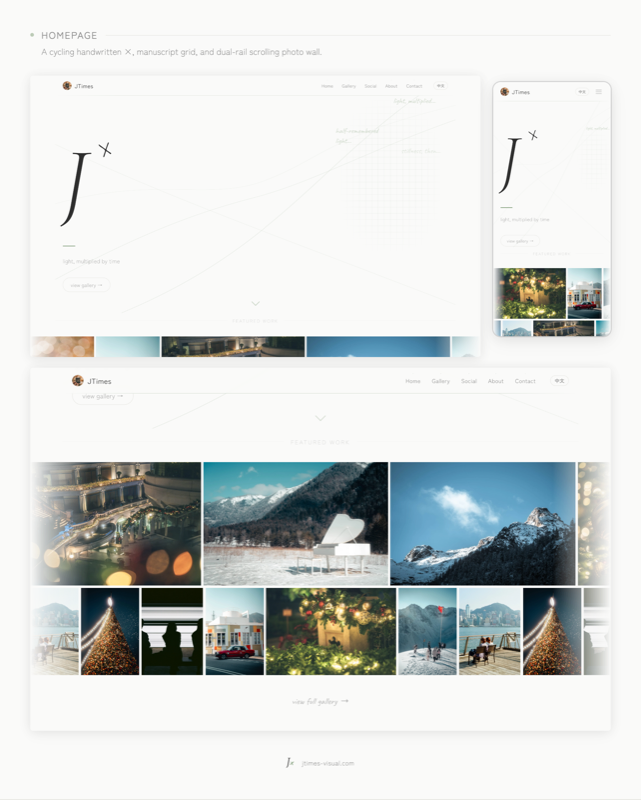
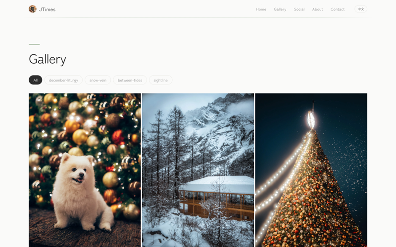
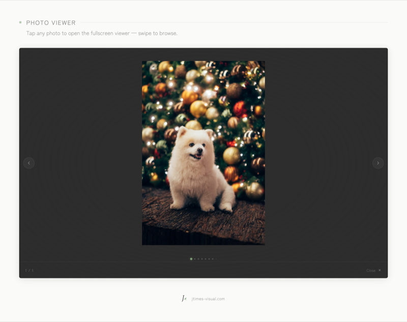
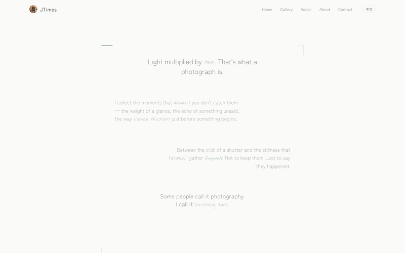
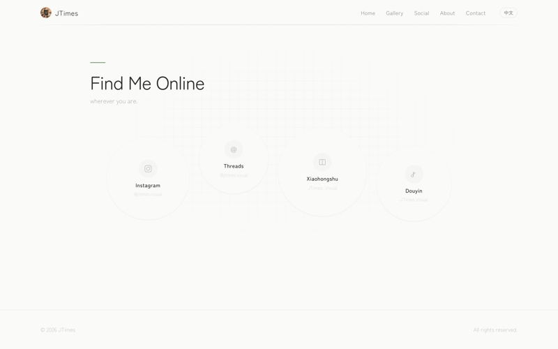

# J&times; &mdash; 光，乘以時間

個人攝影作品集，使用 [Astro](https://astro.build) 和 [Tailwind CSS](https://tailwindcss.com) 構建。

[](https://astro.build)
[](https://tailwindcss.com)
[](LICENSE)

<!-- language-selector-start -->
[English](README.md) &nbsp;&middot;&nbsp; **繁體中文**
<!-- language-selector-end -->

## 頁面截圖

<p align="center">
  
  
  
  
</p>

<details>
<summary>更多頁面</summary>
<p align="center">
  
  
</p>
</details>

## 品牌

**J&times;** &mdash; J 是 Cormorant Garamond 斜體襯線字，&times; 在三種手寫字體之間每 7.5 秒循環切換。點擊可以讓它彈跳。

名字來自創作者的名字 James：*J* 取自名字的首字母，而 *times* 既是乘法，也指時光、片刻、事物的流逝。讀起來，JTimes 的發音本身就接近 James。J&times; 這個標記既是簽名，也是一種縮寫——一個半隱半現的名字。

網站以鼠尾草綠為點綴色，搭配暖白紙色背景，字體使用 Zen Maru Gothic 和 Zen Kaku Gothic New。所有組件均為本專案從頭構建，沒有使用任何現成模板或 UI 套件。

## 功能特色

### 內容管理

- **管理後台** &mdash; 瀏覽器端的 CMS（`/admin`，僅開發環境）。拖放上傳，自動壓縮至 2400px JPEG，批次編輯 metadata，支援編號系列命名。無需外部服務。
- **內容集合** &mdash; 照片 metadata 以 Markdown frontmatter 儲存，使用 Zod schema 驗證。雙語內容存放於 `src/content/photos/{en,zh-cn}/`。

### 作品集與檢視

- **瀑布流作品集** &mdash; CSS columns 佈局，交錯淡入動畫。按系列篩選，採用全局淡出過渡模式，避免逐卡片定時器管理。
- **種子隨機排序** &mdash; Fisher-Yates 洗牌演算法配合確定性偽隨機數生成器，照片順序隨機但每次載入保持一致。
- **FilmStrip 檢視器** &mdash; 自訂全螢幕照片瀏覽器，配備模糊環境背景交叉淡入、暗角覆層、水平滾動吸附、懸浮邊緣箭頭及滑動導航點。包含以 OpenStreetMap 真實海岸線資料生成的線條地圖。取代了早期的 PhotoSwipe 整合。
- **FeaturedWall** &mdash; 首頁雙軌自動滾動照片牆（上方軌道向左、下方軌道向右，不同速度），搭配 CSS `mask-image` 羽化邊緣。

### 版面與設計

- **首頁** &mdash; 超大 J&times; 標記、流動的 SVG 光線、手稿網格與淡入淡出的詩意片段、向下滾動箭頭，以及下方的 FeaturedWall。
- **關於頁面** &mdash; 意識流文字，採用不對稱的對齊節奏（居中 &rarr; 靠左 &rarr; 靠右 &rarr; 居中）。取景框角標框住文字。選定的關鍵詞以手寫字體內嵌呈現，營造混合字體的文學效果。
- **社交媒體頁面** &mdash; 圓形「泡泡星座」&mdash;四個平台連結以不同大小的圓形呈現，flex-wrap 形成有機的 S 型排列，hover 時有鼠尾草綠光暈。
- **聯繫頁面** &mdash; 簡單的聯絡方式列表。

### 效能

- **CLS 防止** &mdash; 瀑布流網格項目使用 `aspect-ratio`、`contain: layout style`，FilmStrip 延遲圖片載入（僅在檢視器打開時載入圖片）。
- **GPU 優化互動** &mdash; 硬體加速的 hover 變換，配合獨立的合成圖層。
- **View Transitions** &mdash; Astro SPA 導航，對於有閉包狀態的組件使用 `AbortController` 事件監聽器生命週期。相關模式記錄在 `CLAUDE.md` 中。
- **響應式設計** &mdash; 漢堡選單手機導航、自適應作品集列數（3 &rarr; 2 &rarr; 1）、手機詩意網格、全站觸控友善。
- **監控** &mdash; Vercel Analytics + Speed Insights，追蹤網站流量與效能。

### 國際化

- **雙語** &mdash; 英文（`/en/`）和繁體中文（`/zh-cn/`）。`prefixDefaultLocale` 路由。所有 UI 字串存放在型別安全的 `i18n.ts` 字典中。

## 技術棧

| 層面 | 選擇 |
|---|---|
| 框架 | [Astro v5](https://astro.build) |
| 樣式 | [Tailwind CSS v3](https://tailwindcss.com) + `@astrojs/tailwind` |
| 圖片 | `astro:assets` + Sharp |
| 字體 | Google Fonts（Cormorant Garamond、Zen Maru Gothic、Zen Kaku Gothic New、Caveat、Waiting for the Sunrise、Nothing You Could Do、Noto Sans SC） |
| 國際化 | Astro 內建路由 |
| 截圖 | Playwright |
| 部署 | [Vercel](https://vercel.com) |

> [!IMPORTANT]
> 本專案最初使用 `@tailwindcss/vite`（Tailwind CSS v4），但 Vite 插件在掃描 `.astro` 模板檔案中的 class 名稱時靜默失敗，導致構建時不生成任何 utility class 且不報錯。改用 `@astrojs/tailwind` 配合 PostCSS 和 Tailwind v3 解決了此問題。

## 專案結構

```
src/
├── admin/                  # 瀏覽器端 CMS（僅開發環境）
│   └── api/                #   認證、照片 CRUD、上傳處理
├── assets/images/photos/   # 已最佳化的照片（2400px JPEG）
├── assets/maps/            # 生成的線條 SVG 地圖（香港、四川等）
├── components/
│   ├── gallery/            # PhotoGrid、PhotoCard、LazyImage、FilterBar、FilmStrip、FeaturedWall
│   ├── layout/             # BaseLayout、Header、Footer、SEO
│   └── ui/                 # LanguageSwitcher
├── content/photos/         # 照片 Markdown 內容（en/ + zh-cn/）
├── lib/                    # i18n 翻譯、照片資料存取
├── pages/                  # 路由頁面（en/ + zh-cn/）
├── plugins/                # Vite 插件（管理後台中介軟體）
└── styles/global.css       # Tailwind 指令 + 自訂樣式
scripts/
├── screenshots.mjs         # Playwright — 擷取桌面 + 手機截圖
├── social-cards.mjs        # 生成社交媒體用卡片圖片
├── generate-maps.mjs       # 從 OSM 海岸線/行政邊界資料生成線條 SVG 地圖
├── optimize-images.ts      # 基於 Sharp 的圖片預處理器
└── new-photo.ts            # 互動式照片內容脚手架
```

## 快速開始

```bash
npm install
npm run dev          # → http://localhost:4321
```

### 添加照片

**管理後台（推薦）：**

在開發伺服器運行時打開 `http://localhost:4321/admin`。拖放照片，為整批設定一次 metadata，後台會自動處理壓縮和雙語 `.md` 檔案生成。

**命令列：**

```bash
npm run optimize-images -- <輸入目錄>
npm run new-photo -- <檔名.jpg> <slug>
```

### 生成截圖

```bash
npm run dev                              # 先啟動開發伺服器
node scripts/screenshots.mjs             # 擷取所有頁面 → scripts/screenshots/
node scripts/social-cards.mjs            # 生成卡片 PNG → scripts/screenshots/posts/
```

`scripts/screenshots/index.html` 中的展示頁面以編輯排版呈現所有截圖。需要 Playwright（已包含在開發依賴中）。

### 生產構建

```bash
npm run build      # → dist/
```

## 設計 Token

| Token | 值 | 用途 |
|---|---|---|
| `ink` | `#2d2d2d` | 主要文字 |
| `paper` | `#fafaf9` | 背景 |
| `muted` | `#8c8c8c` | 次要文字 |
| `accent` | `#7d9b76` | 鼠尾草綠點綴 |
| Display | Zen Maru Gothic | 標題、導航 |
| Body | Zen Kaku Gothic New | 內文、介面 |
| Logo J | Cormorant Garamond | 首頁標記（細斜體襯線） |
| Logo &times; | Caveat / Waiting for the Sunrise / Nothing You Could Do | 循環手寫字體 |

## 部署

部署於 [Vercel](https://vercel.com)，網址 **[jtimes-visual.com](https://jtimes-visual.com)**，使用 Cloudflare DNS。推送至 `main` 分支會自動觸發部署（通常 1&ndash;2 分鐘）。

## 授權

MIT
